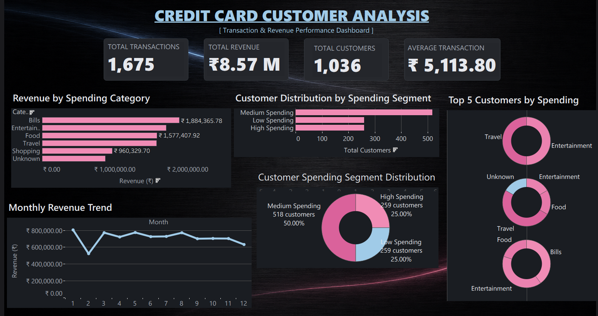
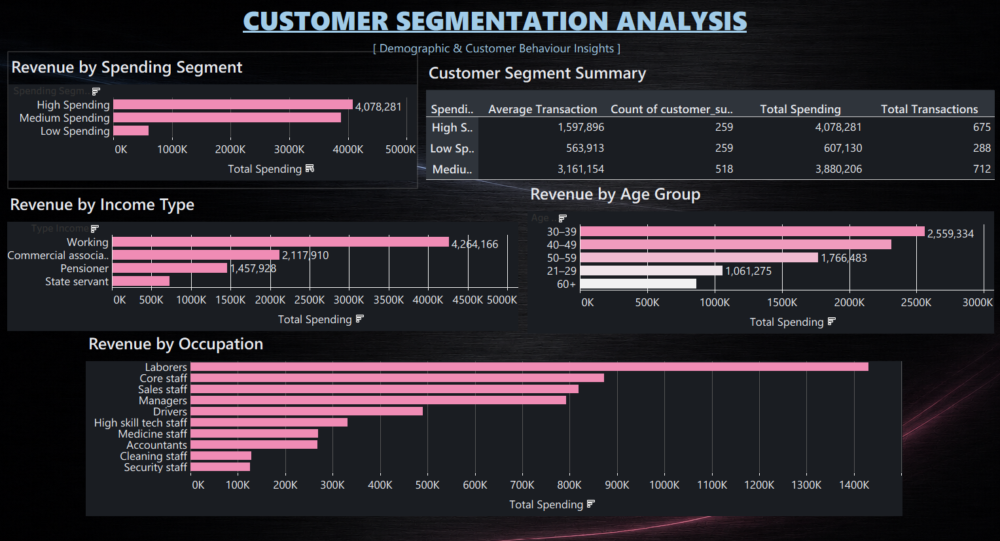

# Credit Card Customer Segmentation & Spending Analytics

## Overview

This project demonstrates an end-to-end analytics workflow for customer segmentation and spending analysis in the Financial Services domain. The project focuses on transforming raw customer and transaction data into meaningful business insights using Python, PostgreSQL, SQL, and Tableau.

The repository covers the complete analytical pipeline, including data cleaning, synthetic transaction generation, database design, SQL analysis, exploratory data analysis, and customer segmentation.

---

# Business Objective

A financial institution wants to better understand customer spending behaviour, identify high-value customer groups, and uncover demographic patterns that can support targeted marketing campaigns and future predictive analytics.

This project transforms raw customer and transaction data into actionable business insights through SQL, Python, PostgreSQL, and Tableau:

- Identifying high-value customers
- Segmenting customers based on spending behaviour
- Understanding transaction patterns
- Supporting targeted marketing strategies
- Building a reusable analytical dataset for future predictive analytics

---

## Requirements Translation

The business objective was broken into specific analytical requirements before development:

| Business Ask | Requirement | Deliverable |
|---|---|---|
| Identify high-value customers | Spending-based segmentation with defined value tiers | Customer Segmentation module (Section D) |
| Understand transaction patterns | Category, monthly, and distribution-level transaction analysis | Transaction Analysis module (Section B) |
| Uncover demographic drivers of spend | Revenue breakdown by age, gender, income type, education, occupation, housing | Customer Spending Analysis module (Section C) |
| Support targeted marketing | Segment-level summary dataset exportable for campaign targeting | Tableau-ready Customer Summary Dataset |
| Build a reusable analytical base | Normalized PostgreSQL schema supporting repeatable queries | Database Creation + Views (SQL Modules) |

This ensured each SQL/Python module was scoped to a specific stakeholder question rather than open-ended exploration.

---


# Project Status

**Current Phase:** Phase 1 – Customer Segmentation & Spending Analytics

### Completed

- Customer Data Cleaning
- Synthetic Transaction Generation
- Transaction Data Cleaning
- PostgreSQL Database Design
- SQL Analysis
- SQL Views
- Python Exploratory Data Analysis
- Customer Segmentation
- Visualization Generation
- Tableau Dashboard

### Planned

- Business Dashboard Storytelling
- Documentation Refinement

---

# Technology Stack

- Python
- Pandas
- NumPy
- PostgreSQL
- SQL
- Jupyter Notebook
- Matplotlib
- Tableau (In Progress)

Database design follows core RDBMS/DBMS principles — normalized relational structure across customer and transaction tables, referential integrity via customer_id, and reusable SQL views for repeatable analysis.

---

# Repository Structure

```
Credit Card Customer Analytics/

│
├── data/
│   ├── Credit_card.csv
│   ├── Clean_Customer.csv
│   ├── Clean_Transaction.csv
│   ├── customer_summary.csv
│   └── transactions_raw.csv
│
├── Python_src/
│   ├── customer_cleaning.py
│   ├── Transactions_cleaning.py
│   ├── generate_transactions.py
│   ├── DB_creation.py
│   ├── Table_Creation.py
│   └── EDA_Customer_Segmentation.ipynb
│
├── SQL/
│   ├── database_creation.sql
│   ├── table_creation.sql
│   ├── data_validation.sql
│   ├── customer_analysis.sql
│   ├── transaction_analysis.sql
│   ├── customer_segmentation.sql
│   └── views.sql
│
├── visuals/
│
├── .gitignore
├── requirements.txt
└── README.md
```

---

# Dataset Description

## Customer Dataset

**Rows:** 1,525

**Columns**

- id
- gender
- car_owner
- propert_owner
- children
- income
- type_income
- education
- marital_status
- housing_type
- age
- days_employed
- mobile_phone
- work_phone
- phone
- email_id
- type_occupation
- family_members

---

## Transaction Dataset

**Rows:** 1,675

**Columns**

- id
- customer_id
- amount
- category
- date
- month
- weekday
- day

---

## Key Findings

- **Working professionals** generated nearly half of total revenue — the single largest income-type contributor.
- Customers aged **30–39** contributed the highest spending among all age groups.
- **Bills** and **Entertainment** were the dominant transaction categories by volume and value.
- **Medium Spending** customers formed approximately 50% of the customer base — the largest single tier.
- **Laborers** generated the highest spending among occupational groups, an unexpected result worth highlighting to stakeholders.
- Revenue remained relatively stable across the year, with only seasonal fluctuations rather than sharp swings.

---

## Customer Segmentation (RFM-Based)

Customers were segmented using Recency, Frequency, and Monetary (RFM) dimensions:

- **Recency** — days since last transaction, tiered via SQL (Low/Medium/High recency)
- **Frequency** — total transaction count per customer, tiered via SQL
- **Monetary** — total spending and average transaction value, tiered via SQL

Frequency and Monetary segments are visualized in the Tableau dashboard (Spending Segment views); Recency scoring is available in the underlying dataset (`customer_summary.csv`) for extended segmentation use.

---

# Project Workflow

```
Raw Customer Dataset

↓

Python Cleaning

↓

Clean Customer Dataset

↓

Synthetic Transaction Generation

↓

PostgreSQL

↓

SQL Analysis

↓

Customer Summary

↓

Python EDA

↓

Tableau Dashboards

↓

Business Insights
```

---

# SQL Modules

The SQL folder includes:

- Database Creation
- Table Creation
- Data Validation
- Customer Analysis
- Transaction Analysis
- Customer Segmentation
- Reusable SQL Views

Data Validation queries were run against both customer and transaction tables prior to analysis, checking for null values, duplicate IDs, and referential mismatches between datasets.

---

# Python Analysis

The notebook is divided into the following sections:

### Section A

Dataset Overview

- Data Loading
- Data Validation
- Descriptive Statistics

### Section B

Transaction Analysis

- Revenue KPIs
- Category Performance
- Monthly Revenue Analysis
- Monthly Transaction Analysis
- Transaction Distribution
- Top Spending Customers

### Section C

Customer Spending Analysis

- Revenue by Age Group
- Revenue by Gender
- Revenue by Income Type
- Revenue by Education
- Revenue by Occupation
- Revenue by Housing Type

### Section D

Customer Segmentation

- Customer Summary Dataset
- Spending Distribution
- Spending Segmentation
- Customer Recency
- Segment Comparison
- Tableau Dataset Export

---
# Tableau Dashboard

Dashboard page 1



Dashboard page 2



---

# Current Outputs

Generated visualizations include:

- Revenue by Spending Category
- Monthly Revenue Trend
- Monthly Transaction Volume
- Transaction Amount Distribution
- Top Spending Customers
- Revenue by Age Group
- Revenue by Gender
- Revenue by Income Type
- Revenue by Education
- Revenue by Occupation
- Revenue by Housing Type
- Customer Spending Distribution
- Customer Segment Distribution
- Revenue by Spending Segment
- Average Spending by Segment
- Average Transactions by Segment

---

# Future Roadmap

## Phase 1

Customer Segmentation & Spending Analytics

(Current Phase)

---

## Phase 2

Customer Churn Prediction

---

## Phase 3

Customer Retention Analytics

Potential future enhancements:

- Customer Lifetime Value (CLV)
- Credit Risk Analytics

---

# Author

**Meenansh Chauhan**

Business Analytics | Data Analytics | SQL | Python | PostgreSQL | Tableau
